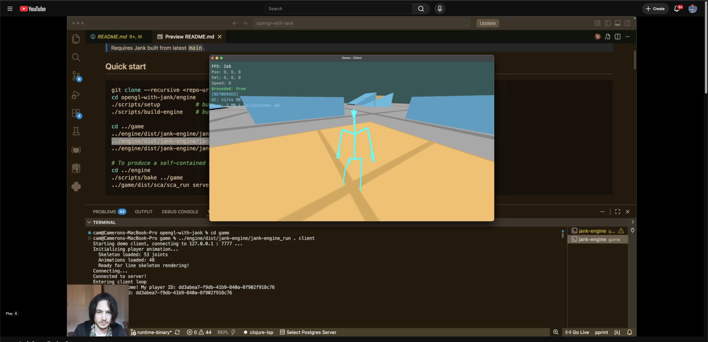

# OpenGL with Jank

A jank+OpenGL game engine and a game built on it ("Strafe Combat Academy"). Written in [Jank](https://jank-lang.org/) (a Clojure-on-LLVM dialect with C++ interop) with networked multiplayer, skeletal animation, and Quake-style movement.

> Requires Jank built from latest `main`.

Watch the [demo video on YouTube](https://youtu.be/hVQB7G6YVKQ):

[](https://youtu.be/hVQB7G6YVKQ)


## Quick start

```bash
git clone --recursive <repo-url>
cd opengl-with-jank/engine
./scripts/setup           # build native deps + libengine_assets
./scripts/build-engine    # build the jank-engine runtime binary with lein-jank

cd ../game
../engine/dist/jank-engine/jank-engine_run . server   # host on port 7777
../engine/dist/jank-engine/jank-engine_run . client   # join (in another terminal)
../engine/dist/jank-engine/jank-engine_run . editor   # open the course editor

# To produce a self-contained game bundle for shipping:
cd ../engine
./scripts/bake ../game                    # output: game/dist/sca/
../game/dist/sca/sca_run server           # runs without XCode CLI tools
```

## Repo layout

```
opengl-with-jank/
├── engine/      # Reusable jank+OpenGL runtime
│   ├── src/engine/         16 jank namespaces (gfx2d, gfx3d, networking, …)
│   ├── include/            engine *_impl.h + bundled third-party headers
│   ├── assets/             shaders/, fonts/ — embedded in the engine binary
│   ├── scripts/            setup, build-engine, asset pipeline, platform/
│   ├── third_party/        ozz-animation, tinygltf
│   ├── libs/               glm + per-platform native libs
│   └── tools/              gla2ozz, ozz2gltf, ozz-retarget
└── game/        # Strafe Combat Academy
    ├── src/sca/            game namespaces
    ├── include/sca/        game-side *_impl.h
    ├── models/             glTF assets
    ├── textures/
    └── jank-engine.edn     entry namespace + classpath config
```

The two trees are independent — no symlinks between them. The engine knows nothing about the game; the game references the engine only by invoking the `jank-engine` binary.

## How it works

`jank-engine` is a single AOT-compiled binary that bakes in every `engine.*` namespace plus all native deps (GLFW, ozz, ENet, STB, cgltf, GLM headers, libc++, clang JIT). At run time it reads the game directory's `jank-engine.edn`, adds the game's `:paths` to the module loader, and `(require ...)` the `:entry` namespace — JIT-compiled by the embedded clang. Game source is loose `.jank` files; the engine binary is reusable across games (similar model to LÖVE/LÖVR).

## How lein-jank fits in

lein-jank owns the jank compilation step; the repo's shell scripts still own native dependency setup, dylib bundling, rpaths, asset copying, launchers, and final distribution layout.

- `engine/scripts/build-engine` runs `lein compile` from `engine/`, using `engine/project.clj` and `engine/lein-jank-config.clj`, then packages the reusable `jank-engine_run` runtime.
- `engine/scripts/bake` runs `lein compile` from the game directory, using the game's `project.clj` and `lein-jank-config.clj`, then packages a standalone baked game bundle.
- The lein-jank config files define source paths, `:main`, platform-specific include/library/link flags, output names, target directories, and optimization levels. The reusable engine binary also sets `:runtime :dynamic` so it can JIT-load loose game source at runtime.
- During bake, the script overrides the game config with `JANK_NAME`, `JANK_TARGET_DIR`, and `JANK_OPTIMIZATION_LEVEL` so `jank-engine.edn` remains the source of bundle name/assets while lein-jank still performs the compile.

On macOS, the build scripts invoke Leiningen through the standalone jar with Java instead of the `lein` shell wrapper. This preserves `DYLD_INSERT_LIBRARIES`, which is needed to preload the ozz libraries while jank compiles namespaces that bind animation symbols.

## Modes

The bundled game (`game/`) dispatches on its first arg:

| Mode | Description |
|------|-------------|
| `client [host]` | Join a server (default `localhost`) |
| `server` | Host on port 7777 |
| `editor` | Course designer (build, save `.map`) |
| `viewer` | Animation viewer for the JKA player skeleton |
| `net-test {server\|client}` | ENet smoke test |

Run with `jank-engine_run . <mode>` from inside `game/`.

## Features

- **Networking** — Server-authoritative architecture with client-side prediction and snapshot interpolation. ENet UDP transport.
- **Animation** — ozz-animation runtime with GPU skinning, skeletal line rendering, behavior-tree state machine over 50+ states.
- **Physics** — Quake-style movement (friction, accel, air control, force-jump). Slope normals.
- **Collision** — Raycast against glTF collision meshes.
- **Behavior trees** — Vector DSL for game logic.
- **Course editor** — Place / resize brushes, save/load `.edn` and JKA-compatible `.map`.
- **Debug overlays** — F3 (FPS, position, velocity), F4 CGaz strafehelper.

## Dependencies

Jank, Leiningen with lein-jank, GLFW, OpenGL 3.3+, GLM (header-only), STB, cgltf, ozz-animation, ENet.

## Distribution

Two paths depending on audience.

### Dev iteration: `jank-engine_run`

`./scripts/build-engine` produces `engine/dist/jank-engine/` (~324 MB) — a reusable runtime that JIT-loads any game directory:

```
dist/jank-engine/
├── bin/jank-engine          executable
├── lib/jank-engine/         bundled dylibs (incl. libengine_assets)
├── lib/jank/0.1/            jank runtime: clang, libc++, headers, stdlib
├── include/                 third-party headers (glm, GLFW, ozz, engine *_impl.h)
└── jank-engine_run          launcher
```

Iterate on game source without rebuilding the engine. Requires XCode Command Line Tools on the running machine (jank's JIT calls clang).

### Shipping a game: `bake`

`./scripts/bake <game-dir>` produces `<game-dir>/dist/<name>/` — engine + a specific game's source, AOT-compiled into one static-runtime binary. The game directory must include a lein-jank `project.clj`; `jank-engine.edn` supplies the baked bundle name and asset directories.

```
<game-dir>/dist/<name>/
├── bin/<name>               AOT executable (engine + game baked together)
├── lib/<name>/              bundled dylibs
├── models/  textures/       game assets (per :assets in jank-engine.edn)
└── <name>_run               launcher
```

**End users need nothing.** No XCode CLI tools, no jank, no clang, no LLVM runtime. Baked bundles use jank's static runtime, so they cannot JIT loose source or runtime `eval`; all game and engine namespaces must be compiled into the binary.

To distribute: ship the `dist/<name>/` directory; users run `./<name>_run`.

How and why the no-prereq baked bundle works is documented in [engine/docs/bake-distribution.md](engine/docs/bake-distribution.md).

## Platform support

**macOS (Apple Silicon)** — primary platform, fully supported.
**Linux / Windows** — platform abstraction stubs exist; no working build path yet. (To produce a Linux `jank-engine`, run `./scripts/build-engine` on a Linux machine once the platform helpers are filled in.)

## Points of interest

- **[clet macro](engine/src/engine/macros.jank)** — C-style error handling that flattens nested conditionals.
- **[C++ interop notes](CPP_INTEROP_DOCUMENTATION.md)** — patterns and gotchas for `cpp/raw` blocks.

## License

For learning purposes. Use as you see fit.
