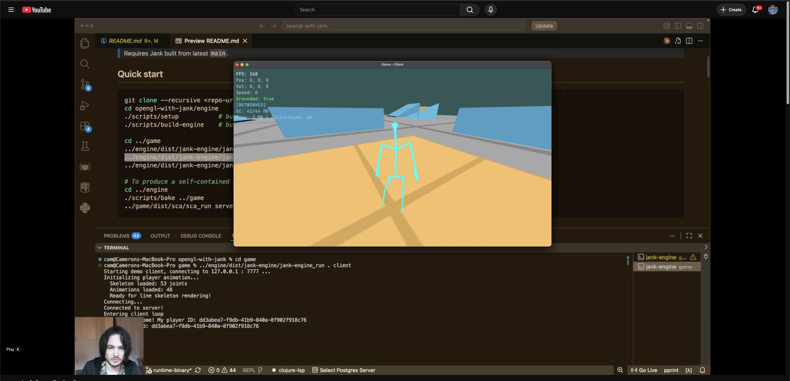

# OpenGL with Jank

A jank+OpenGL game engine and a game built on it ("Strafe Combat Academy"). Written in [Jank](https://jank-lang.org/) (a Clojure-on-LLVM dialect with C++ interop) with networked multiplayer, skeletal animation, and Quake-style movement.

> Requires a compatible Jank on `PATH`. CI tracks `jank-lang/jank` `main`, builds against LLVM 23,
> and caches builds by the upstream commit and toolchain version.

Watch the [demo video on YouTube](https://youtu.be/hVQB7G6YVKQ):

[](https://youtu.be/hVQB7G6YVKQ)


## Quick start

```bash
git clone --recursive <repo-url>
cd opengl-with-jank/engine
./scripts/setup           # initialize submodules + install engine source package
./scripts/build-engine    # build the jank-engine runtime binary with lein-jank

cd ../game
../engine/dist/jank-engine/jank-engine_run . server   # host on port 7777
../engine/dist/jank-engine/jank-engine_run . client   # join (in another terminal)
../engine/dist/jank-engine/jank-engine_run . editor   # open the course editor

# To produce a self-contained game bundle for shipping:
cd ../engine
./scripts/bake ../game                    # output: game/dist/sca/
../game/dist/sca/sca_run server           # runs without XCode CLI tools
```

## Repo layout

```
opengl-with-jank/
├── engine/      # Reusable jank+OpenGL runtime
│   ├── src/engine/         16 jank namespaces (gfx2d, gfx3d, networking, …)
│   ├── include/            engine *_impl.h + bundled third-party headers
│   ├── assets/             shaders/, fonts/ — embedded in the engine binary
│   ├── scripts/            setup, build-engine, asset pipeline, distribution helpers
│   ├── third_party/        ozz-animation, tinygltf
│   ├── libs/               glm source submodule
│   └── tools/              gla2ozz, ozz2gltf, ozz-retarget
└── game/        # Strafe Combat Academy
    ├── src/sca/            game namespaces
    ├── include/sca/        game-side *_impl.h
    ├── models/             glTF assets
    ├── textures/
    └── jank-engine.edn     entry namespace + classpath config
```

The two trees are independent — no symlinks between them. The engine knows nothing about the game. Game builds depend on the engine source package; loose-source development uses the reusable `jank-engine` binary.

## How it works

`jank-engine` is a single AOT-compiled binary that bakes in every `engine.*` namespace and packages the engine-native deps (GLFW, ozz, ENet, STB, cgltf, GLM headers, engine headers). At run time it reads the game directory's `jank-engine.edn`, adds the game's `:paths` to the module loader, eagerly `(require ...)`s configured loose game source namespaces, and realizes deferred function bodies through the developer's installed jank/clang runtime before invoking `:entry`. This moves dev JIT work to startup instead of the first gameplay frame that touches a code path; `:preload` may be `:all`, `false`, an explicit namespace list, or a mode-keyed map. Game source is loose `.jank` files; the engine binary is reusable across games (similar model to LÖVE/LÖVR).

## How lein-jank fits in

lein-jank owns compilation, native dependency builds, and their caches. Both projects use ordinary `project.clj` configuration and `jank-build.bb` scripts; there are no platform-specific Leiningen config loaders.

- Commons `gl-sys` and `glfw-sys` discover installed OpenGL/GLFW and supply the native flags. macOS links the OpenGL framework directly.
- The engine is a source package with a native build script. Its CMake build installs ozz, STB, cgltf, ENet, GLM, and engine headers into jank's managed output directory. Linux also discovers GLEW through `pkg-config`.
- Engine shaders and fonts become a generated header compiled by jank, with no separate asset library.
- `./scripts/setup` initializes submodules and runs `lein install`. Reinstall after engine changes before compiling a consuming game. `bake` does this automatically.
- The game depends on `opengl-with-jank/engine`; it does not repeat engine source paths or native flags.
- `build-engine` and `bake` assemble distributions from persistent `target/` builds. A shared packaging helper follows linked native dependencies, rewrites loader paths, and leaves build caches intact.

Direct development commands:

```bash
cd engine
lein compile                       # target/engine/jank-engine (dynamic runtime)
lein install                       # install the engine source/native package
cd ../game
lein run -- server                 # run through jank
lein with-profile release compile  # target/release/sca (static runtime)
```

Build prerequisites are jank, Leiningen, Babashka, CMake, a C/C++ compiler, and `pkg-config`, plus installed GLFW/OpenGL (and GLEW on Linux). Distribution scripts additionally use Python 3; Linux needs `patchelf` and `bubblewrap` for packaging and jank build sandboxing respectively. On macOS, `brew install leiningen babashka cmake pkgconf glfw python` supplies the extra tools.

If full Xcode's tool shims fail inside jank's native-build sandbox, select the installed Command Line Tools for the build:

```bash
export DEVELOPER_DIR=/Library/Developer/CommandLineTools
export SDKROOT="$(xcrun --sdk macosx --show-sdk-path)"
```

Native library linkage (`:static?`) is independent of jank's `:runtime`. The engine uses `:runtime :dynamic` for loading loose game source; the game uses `:runtime :static` for shipping. Both currently request shared native libraries, which the distribution scripts bundle.

## Modes

The bundled game (`game/`) dispatches on its first arg:

| Mode | Description |
|------|-------------|
| `client [host]` | Join a server (default `localhost`) |
| `server` | Host on port 7777 |
| `editor` | Course designer (build, save `.map`) |
| `viewer` | Animation viewer for the JKA player skeleton |
| `net-test {server\|client}` | ENet smoke test |

Run with `jank-engine_run . <mode>` from inside `game/`.

## Features

- **Networking** — Server-authoritative architecture with client-side prediction and snapshot interpolation. ENet UDP transport.
- **Animation** — ozz-animation runtime with GPU skinning, skeletal line rendering, behavior-tree state machine over 50+ states.
- **Physics** — Quake-style movement (friction, accel, air control, force-jump). Slope normals.
- **Collision** — Raycast against glTF collision meshes.
- **Behavior trees** — Vector DSL for game logic.
- **Course editor** — Place / resize brushes, save/load `.edn` and JKA-compatible `.map`.
- **Debug overlays** — F3 (FPS, position, velocity), F4 CGaz strafehelper.

## Dependencies

Jank, Leiningen with lein-jank, GLFW, OpenGL 3.3+, GLM (header-only), STB, cgltf, ozz-animation, ENet.

## Distribution

Two paths depending on audience.

### Dev iteration: `jank-engine_run`

`./scripts/build-engine` produces `engine/dist/jank-engine/` — a reusable runtime that JIT-loads any game directory. This is a jank-native developer bundle: it requires a compatible `jank` on `PATH` for LLVM/clang/JIT resources instead of bundling those pieces itself.

```
dist/jank-engine/
├── bin/jank-engine          executable
├── lib/jank-engine/         engine-native dylibs
├── include/                 third-party headers (glm, GLFW, ozz, engine *_impl.h)
└── jank-engine_run          launcher
```

Iterate on game source without rebuilding the engine. The launcher checks for `jank` and uses the installed jank environment for dynamic runtime support. On macOS it maps the installed jank LLVM, OpenSSL, and zstd library directories through bundle-local rpath symlinks; set `JANK_LLVM`, `JANK_CRYPTO_DIR`, or `JANK_ZSTD_DIR` if your jank install uses non-standard locations.

### Shipping a game: `bake`

`./scripts/bake <game-dir>` produces `<game-dir>/dist/<name>/` — engine + a specific game's source, AOT-compiled into one static-runtime binary. The game directory must include a lein-jank `project.clj`; `jank-engine.edn` supplies the baked bundle name and asset directories. Static-runtime builds cannot load lazy mode namespaces from loose source, so the sample game's `project.clj` uses `sca.baked`, a bake-only entry that top-level requires every supported mode before delegating to `sca.core`.

```
<game-dir>/dist/<name>/
├── bin/<name>               AOT executable (engine + game baked together)
├── lib/<name>/              bundled dylibs
├── models/  textures/       game assets (per :assets in jank-engine.edn)
└── <name>_run               launcher
```

**End users need nothing.** No XCode CLI tools, no jank, no clang, no LLVM runtime. Baked bundles use jank's static runtime, so they cannot JIT loose source or runtime `eval`; all game and engine namespaces must be compiled into the binary.

To distribute: ship the `dist/<name>/` directory; users run `./<name>_run`.

Before distributing, run `./scripts/verify-portability dist/jank-engine` and
`./scripts/verify-portability <game-dist>` from `engine/`. How and why the
no-prereq baked bundle works is documented in
[engine/docs/bake-distribution.md](engine/docs/bake-distribution.md).

## Platform support

**macOS (Apple Silicon)** — primary platform, fully supported.
**Linux (x86_64)** — built and smoke-tested in CI with Xvfb.
**Windows** — no working build or distribution path yet.

## Points of interest

- **[clet macro](engine/src/engine/macros.jank)** — C-style error handling that flattens nested conditionals.
- **[C++ interop notes](CPP_INTEROP_DOCUMENTATION.md)** — patterns and gotchas for `cpp/raw` blocks.

## License

For learning purposes. Use as you see fit.
